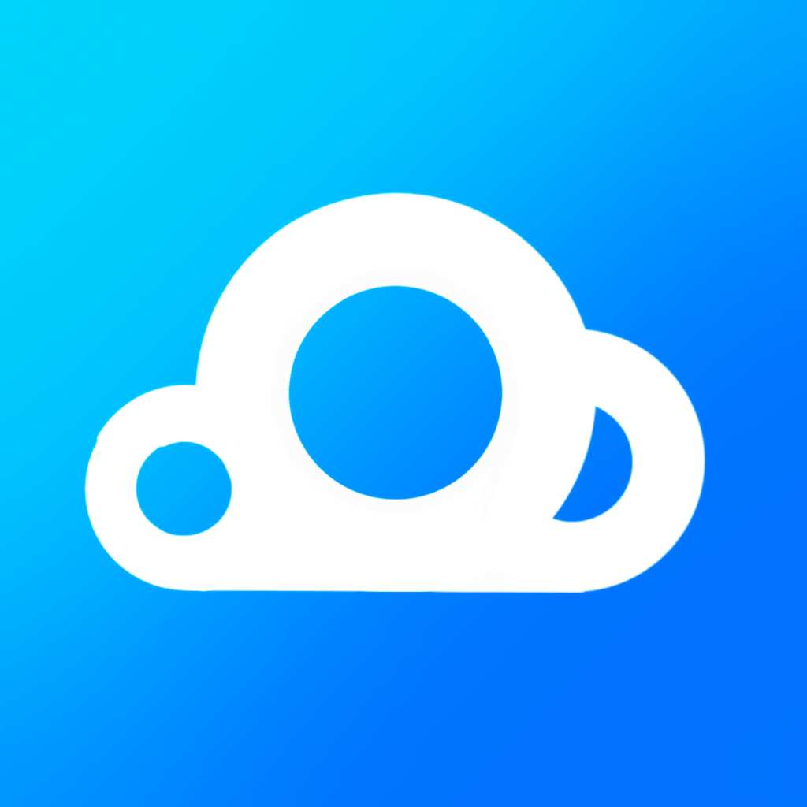
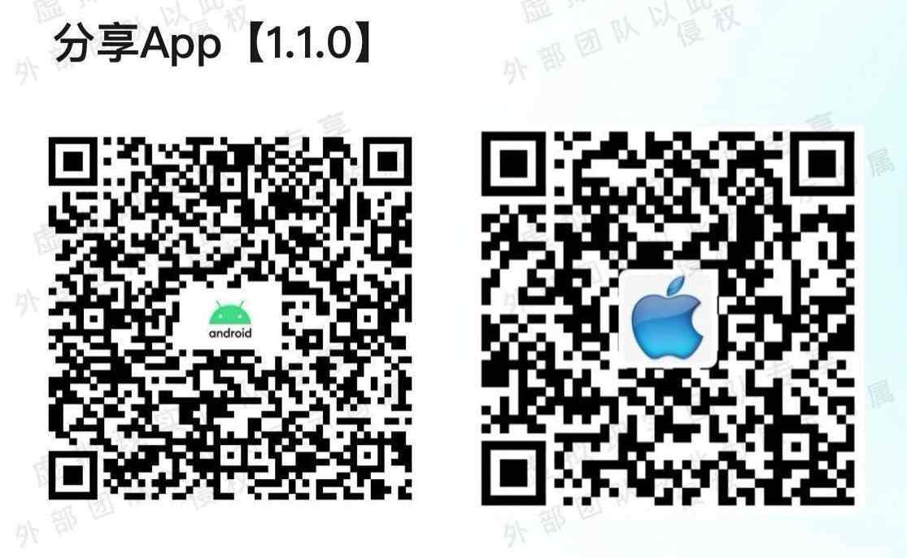

  

<h1 align="center">小北云App</h1>

<strong>大学生喜欢的多功能组合App</strong>

<h6 align="center">此项目仅限学习交流！</h6>

## B站功能演示视频：[点击观看视频](https://www.bilibili.com/video/BV1Tq421A72s)

### 平台功能：

#### · 学习通：
1. ***学习通课程签到***：支持 $\text{\color{red}普通、手势、拍照、位置、二维码签到}$ ；同时也支持组合式签到，也就是签到之后还要走： $\text{\color{red}滑块、点按、旋转等验证码}$ 的签到；
2. ***学习通群聊签到***：支持 $\text{\color{red}普通、手势、拍照、位置、二维码签到}$ ；
3. ***学习通实习打卡***：支持手动打卡和自动打卡两种模式；
4. ***小北云签***：支持24小时监听签到，目前支持的签到含：普通、手势、拍照、位置；只要监听到就能签上；
5. ***学习通刷课***：支持单人、多人模式，不对课程门数设限制；
6. ***云搜·学习通作业***：结合如今最先进的人工智能 $\text{\color{red}DeepSeek}$ ，支持边做边AI，日常学习通的作业嘎嘎完成；

#### · 小北云网课联盟（支持的平台如下）：
- 学习通
- 知到/智慧树
- U校园/U校园AI版

#### · 小北云打卡联盟（支持的平台如下）：
- 校友邦
- 职校家园
- 慧职教
- 黔职通
- 工学云
- 习讯云

#### · 校园跑（支持的平台如下）：
- 世界运动校园
- 云运动
- Keep运动
- 待定

#### · AI类
- 小北云-Deepseek、小北云-千问
- 小北机器人、小北机器人Plus（GPT4）

#### · 生活类
- 小北云视频
- 小北云音乐
- 小北云盘
- 小北云去水印

### 下载地址（左边Android、右边iOS）：

### 联系QQ群：946569973

